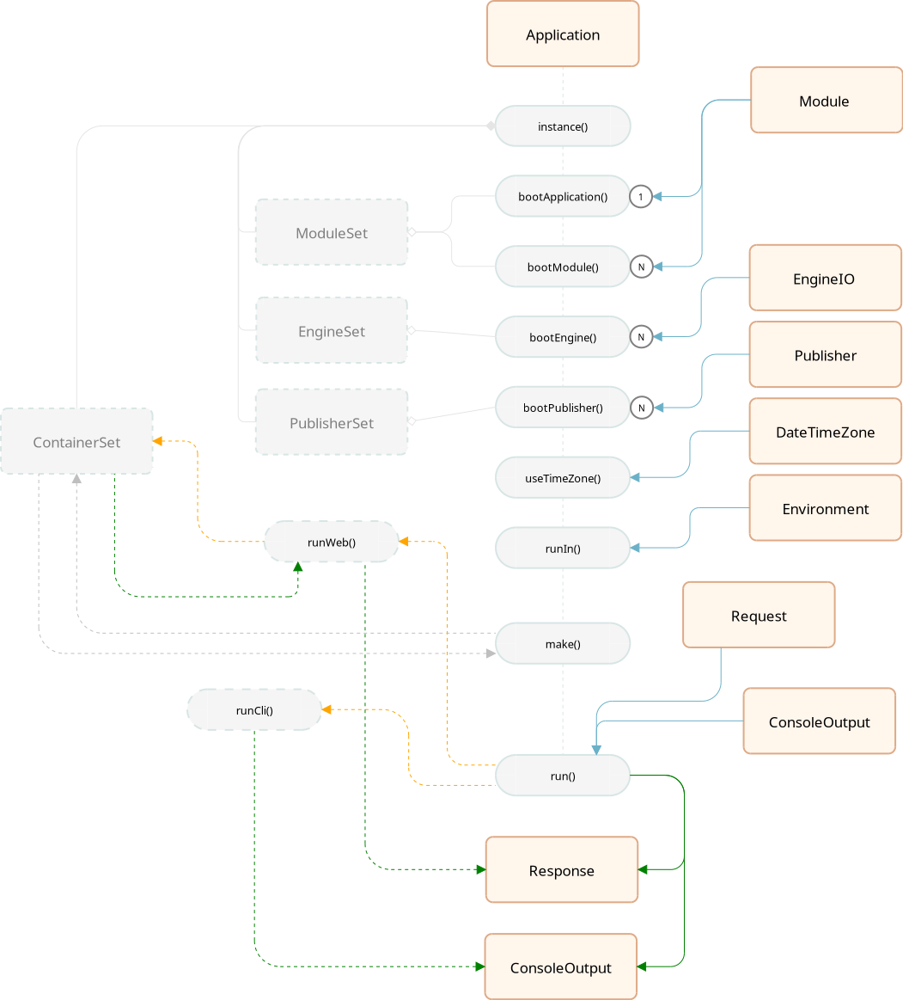

# Architecture

## 1. Creating an application

The `Application` class is the backbone of the project.

### 1.1. Construction

The construction of the application initializes the containers:

- container: the global dependency container
- moduleSet: the list of registered modules
- publisherSet: the list of registered publishers
- engineSet: the list of registered engines
- timezone: 'America/Sao_Paulo'

### 1.2. Providing modules

Both methods add modules to the application.

- bootApplication: adds the main module
- bootModule: adds secondary modules

### 1.3. Providing engines

Adds an input and output interpretation engine. The first engine added will be marked as the main engine of the application. Those added later will be secondary engines.

## 2. Running the application

### 2.1. WEB Requests

When the request comes from an HTTP transaction, only compatible engines will be initialized and executed, even if others have been provided:

- FcEngine: the engine for the FrontController pattern
- MvcEngine: the engine for the MVC pattern

In the process, the following objects will be used:

**ActionExecutor:** the resolution of the requested URI is performed by the `ActionExecutor`
which produces an `ActionDescriptor` containing the result of the resolution

**ActionDescriptor:** a descriptor containing the information necessary to execute the requested action (Mvc:Controller or FrontController:Command).

- decides if $actionClass is of type $actionType
- tries to execute the rule $actionClass::$actionMethod
- returns the response if successful (200)
- returns the response 404 from the main module if it does not exist
- returns the response 500 from the main module if an error occurs

### 2.2. CLI Request

When the request comes from a command terminal, all engines
will be initialized, but only the one compatible with the terminal will be executed:

- ConsoleEngine: the engine for interpreting terminal commands
- FcEngine: the engine for the FrontController pattern
- MvcEngine: the engine for the MVC pattern

The resolution of which terminal routine to execute is performed by the
`iquety/console` library.

