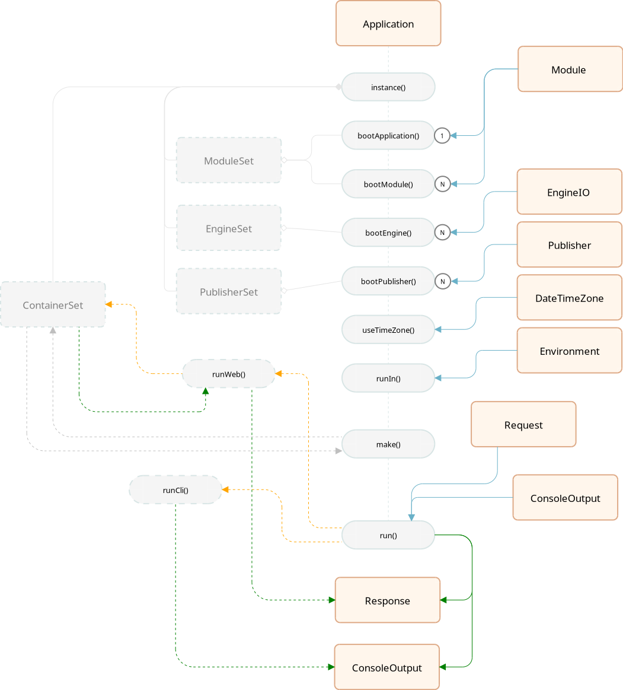

# Arquitetura

## 1. Criando uma aplicação

A classe `Application` é a coluna cervical do projeto.

### 1.1. Construção

A construção da aplicação inicializa os recipientes:

- container: o recipiente global de dependencias
- moduleSet: a lista de módulos registrados
- publisherSet: a lista de publicadores registrados
- engineSet: a lista de motores registrados
- timezone: 'America/Sao_Paulo'

### 1.2. Fornecendo módulos

Ambos os métodos adicionam módulos à aplicação.

- bootApplication: adiciona o módulo principal
- bootModule: adiciona módulos secundários

### 1.3. Fornecendo motores

Adiciona um motor de interpretação de entrada e saída. O primeiro motor
adicionado será marcado como o principal da aplicação. Os que forem adicionados
em seguida, serão motores secundários.

## 2. Executando a aplicação

### 2.1. Requisições WEB

Quando a requisição é proveniente de uma transação HTTP, apenas os motores
compatíveis serão inicializados e executados, mesmo que outros tenham sido
fornecidos:

- FcEngine: o motor para o padrão FrontController
- MvcEngine: o motor para o padrão MVC

No processo, os seguintes objetos serão utilizados:

**ActionExecutor:** a resolução da URI solicitada é efetuada pelo `ActionExecutor`
que produz um `ActionDescriptor` contendo o resultado da resolução

**ActionDescriptor:** um descritor contendo as informações necessárias para a
executar a ação (Mvc:Controller ou FrontController:Command) solicitada.

- decide se $actionClasse é do tipo $actionType  
- tenta executar a regra $actionClass::$actionMethod
- devolve a resposta se sucesso (200)
- devolve a resposta 404 do módulo principal caso não exista
- devolve a resposta 500 do módulo principal caso um erro ocorra

### 2.2. Requisição CLI

Quando a requisição é proveniente de um terminal de comandos, todos os motores
serão inicializados, mas somente o compatível com terminal será executado:

- ConsoleEngine: o motor para interpretar comandos de terminal
- FcEngine: o motor para o padrão FrontController
- MvcEngine: o motor para o padrão MVC

A resolução de qual rotina de terminal executar é efetuada pela biblioteca
`iquety/console`.

